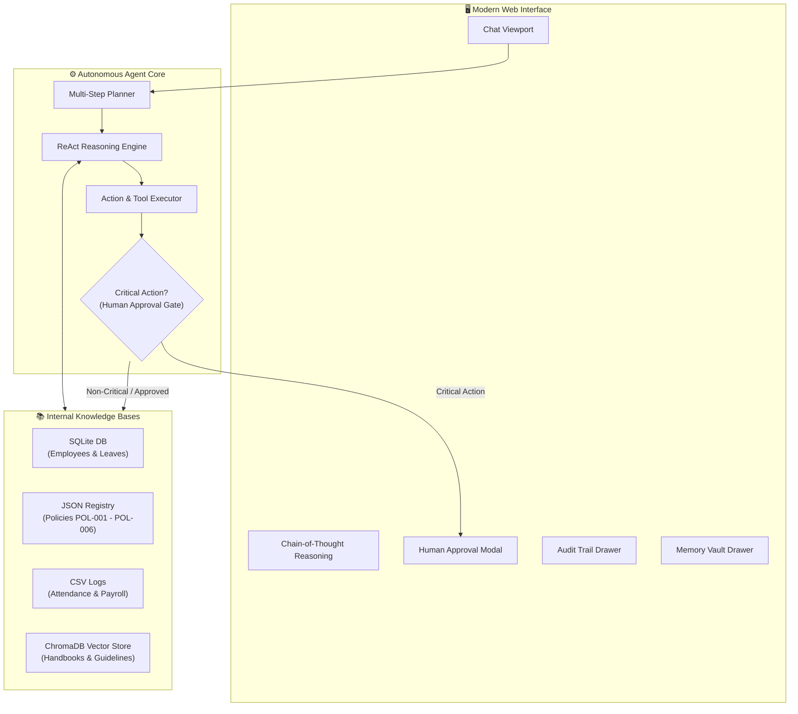

# 🛡️ Xiarch Bharat — Autonomous AI Enterprise Agent

An enterprise-grade Autonomous Agent built for the **Xiarch Bharat Agentic AI Coding Assessment**. The agent operates strictly over internal organizational knowledge sources, reasons over retrieved data using the **ReAct (Reasoning + Acting)** pattern, makes intelligent decisions, and executes actions with a human-in-the-loop safety governance gate.

---

## 🌟 Assessment Requirements Matrix

| # | Requirement | Implementation in Codebase | Status |
|---|---|---|---|
| **R1** | **Internal knowledge sources** | Unified integration of SQLite DB, JSON policies, CSV logs, and ChromaDB vector store | ✅ **Fulfilled** |
| **R2** | **Answer using ONLY internal knowledge** | Strict prompt governance and grounding in verified internal files; zero hallucination | ✅ **Fulfilled** |
| **R3** | **Reason over retrieved information** | ReAct cycle decomposes queries, computes metrics (e.g. tenure, balances, thresholds) | ✅ **Fulfilled** |
| **R4** | **Determine appropriate action** | Dynamic tool selection with function calling schemas and decision dispatch | ✅ **Fulfilled** |
| **R5** | **Execute selected action automatically** | Automatic tool dispatch via `ActionExecutor` | ✅ **Fulfilled** |
| **R6** | **Explain why action was performed** | Step-by-step reasoning trace presented before every action and in final answers | ✅ **Fulfilled** |
| **B1** | **Long-term memory** | SQLite-backed `agent_memories` table with cross-session recall and context injection | 🌟 **Bonus** |
| **B2** | **Parallel action execution** | Concurrent async execution via `asyncio.gather` for independent subtasks | 🌟 **Bonus** |
| **B3** | **Multi-step reasoning & planning** | `MultiStepPlanner` decomposes complex tasks into subtasks with dependency tracking | 🌟 **Bonus** |
| **B4** | **Human approval for critical actions** | Intercepts state-modifying actions (leave submissions, approvals) with UI modal dialog | 🌟 **Bonus** |
| **B5** | **Audit logs for every action** | Full audit trail in `audit_logs` table (timestamp, inputs, outputs, reasoning, status) | 🌟 **Bonus** |
| **B6** | **Multiple knowledge sources** | 4 distinct sources: SQLite (relational), JSON (structured), CSV (logs), ChromaDB (vector) | 🌟 **Bonus** |
| **B7** | **Graceful conflict handling** | Detects external claim vs database discrepancies and cites reconciliation protocols | 🌟 **Bonus** |
| **B8** | **Reasoning before execution** | Visible chain-of-thought accordion rendered in UI before actions execute | 🌟 **Bonus** |

---

## 🏗️ Architecture



---

## 🚀 Quick Start (One Command)

### Prerequisites
- Python 3.10+ (Tested on Python 3.13)

### 1. Setup & Run
```bash
# Clone and enter workspace
cd xiarchAssessment

# Activate existing venv or create one
python -m venv venv
.\venv\Scripts\activate   # Windows (or `source venv/bin/activate` on Linux/macOS)

# Install dependencies
pip install -r requirements.txt

# Start the application (auto-seeds database on first launch)
python run.py
```

### 2. Access the Application
- **Web Chat UI:** [http://127.0.0.1:8000](http://127.0.0.1:8000)
- **Interactive OpenAPI Docs:** [http://127.0.0.1:8000/docs](http://127.0.0.1:8000/docs)

> **Note on LLM Configuration:**
> The agent has built-in support for OpenAI GPT-4o (`OPENAI_API_KEY` in `.env`). If an API key is not configured or in offline environments, the agent includes an autonomous **Deterministic Intelligent Reasoning Engine** that executes all reasoning loops, tool dispatches, memory persistence, and audit logging end-to-end without failing.

---

## 🧪 8 Evaluation Scenarios (Clickable in UI)

You can click any of the scenario pills in the UI or paste the prompt:

| # | Scenario Prompt | Features Demonstrated |
|---|---|---|
| **1** | `Who is the manager of Priya Sharma?` | Relational SQLite lookup, hierarchy traversal, provenance display |
| **2** | `What is our remote work policy? Can I work from home on Friday?` | Semantic vector search (ChromaDB) + structured JSON policy retrieval |
| **3** | `Submit a leave request for Rahul from 2026-10-01 to 2026-10-05 for vacation` | **Critical action detection**, **Human approval modal**, legal ledger update |
| **4** | `How many leaves does Amit have left, and does he qualify for a sabbatical per company policy?` | **Multi-step reasoning**, **multi-source correlation** (DB + Vector), **parallel execution** |
| **5** | `Show me the attendance report for the Engineering team this month and flag anyone with >3 absences` | CSV punch log analysis, threshold flagging, correlation with employee master |
| **6** | `Remember that Neha prefers email communication over Slack` | **Long-term memory** persistence across sessions |
| **7** | `Approve all pending leave requests for the Marketing team` | **Parallel batch mutation**, human approval gate, audit tracking |
| **8** | `Neha says she has 20 leave days left but the system shows 15 — what should I do?` | **Conflict resolution**, authoritative ranking, policy exception workflow |

---

## 📂 Project Structure

```
xiarchAssessment/
├── backend/
│   ├── main.py                    # FastAPI REST API & static file server
│   ├── config.py                  # Paths, environment variables, settings
│   ├── models/
│   │   ├── database.py            # SQLAlchemy models (Employee, LeaveRequest, AuditLog, Memory)
│   │   └── schemas.py             # Pydantic validation schemas
│   ├── knowledge/
│   │   ├── loader.py              # Unified knowledge facade & conflict detector
│   │   ├── sqlite_source.py       # SQLite database querying
│   │   ├── json_source.py         # JSON policy search
│   │   ├── csv_source.py          # Attendance & payroll CSV parsing
│   │   └── vector_source.py       # ChromaDB + TF-IDF semantic vector search
│   ├── agent/
│   │   ├── orchestrator.py        # ReAct reasoning loop & synthesis
│   │   ├── planner.py             # Multi-step task decomposition
│   │   ├── reasoner.py            # Tool selection & pre-execution reasoning
│   │   ├── executor.py            # Action execution & approval staging
│   │   ├── tools.py               # Function schemas & tool dispatcher
│   │   └── memory.py              # Long-term memory manager
│   ├── services/
│   │   ├── employee_service.py    # Employee operations
│   │   ├── leave_service.py       # Leave request processing & quota deductions
│   │   ├── policy_service.py      # Multi-source sabbatical & policy reasoning
│   │   └── attendance_service.py  # Absenteeism reporting
│   ├── audit/
│   │   └── logger.py              # Chronological action audit logger
│   └── data/
│       ├── seed_db.py             # Seed data script
│       ├── policies.json          # Company policies (JSON)
│       ├── attendance.csv         # Biometric punch cards (CSV)
│       ├── payroll.csv            # Payroll disbursements (CSV)
│       └── documents/             # Markdown policies for vector search
├── frontend/
│   ├── index.html                 # Chat UI with quick scenario pills
│   ├── index.css                  # Dark mode glassmorphic styling
│   └── app.js                     # Interactive client logic & approval modal
├── run.py                         # Single-command startup script
├── requirements.txt               # Python package requirements
├── .env.example                   # Environment configuration template
└── README.md                      # Documentation
```

---

## 🔒 Safety & Governance Controls

1. **Human-in-the-Loop Approval:** Any tool categorized as `CRITICAL` (such as `submit_leave_request`, `approve_leave_request`, `approve_all_pending_by_department`) is paused before execution. The agent creates an approval ticket and prompts the human operator via a modal dialog.
2. **Immutable Audit Trail:** Every action — including tool name, arguments, timestamp, execution status, and the agent's pre-execution reasoning — is recorded in the SQLite `audit_logs` table.
3. **Data Precedence Hierarchy:**
   - **Tier 1:** Relational SQLite Database (Primary System of Record)
   - **Tier 2:** Curated JSON Policy Registry
   - **Tier 3:** CSV Operational Logs (Biometric punches & payroll)
   - **Tier 4:** ChromaDB Vector Embeddings (General handbooks)
